# 🔐 AWS IAM User Access Management – Least Privilege Project

This project demonstrates how to implement **secure IAM user, group, and policy management in AWS** using the **Principle of Least Privilege**. It reflects a real-world scenario where users are assigned job-based access using AWS managed and custom IAM policies.

---

## 📋 Table of Contents

- [Project Summary](#-project-summary)
- [Why I Built This Project](#-why-i-built-this-project)
- [Step-by-Step Implementation](#-step-by-step-implementation)
- [Project Objectives](#-project-objectives)

---

## 🟩 Project Summary

- Created IAM groups based on job roles (Admins, Developers, QA Teams)
- Created IAM users and assigned them to appropriate groups
- Attached AWS managed or custom policies to each group
- Enforced least privilege access to EC2 and S3 services
- Simulated real-world support-level permission issues and fixes

---

## ❓ Why I Built This Project

As an aspiring AWS Cloud Support Engineer, I wanted to simulate IAM tasks typically handled by L1/L2 engineers, such as:

- Resolving permission-related support tickets
- Creating and troubleshooting IAM roles and policies
- Applying job-based access management
- Enforcing the **Principle of Least Privilege**

---

## 🧱 Step-by-Step Implementation

### ✅ Step 1: Created IAM Groups

Three IAM groups were created:
- `Admins`
- `Developers`
- `QA_Teams`

📸 *IAM Groups Dashboard*  
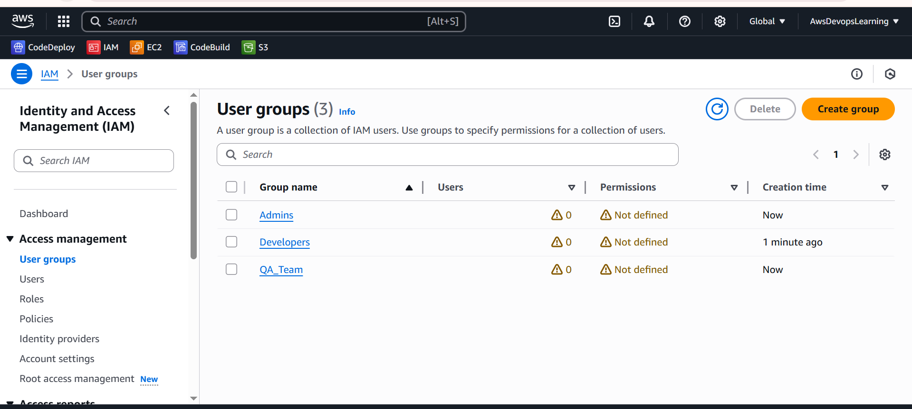

---

### ✅ Step 2: Created IAM Users and Assigned to Groups

Created the following IAM users and added them to groups:
- `admin_riya` → Admins
- `dev_suresh` → Developers
- `qa_amit` → QA_Teams

📸 *Create Developer User*  
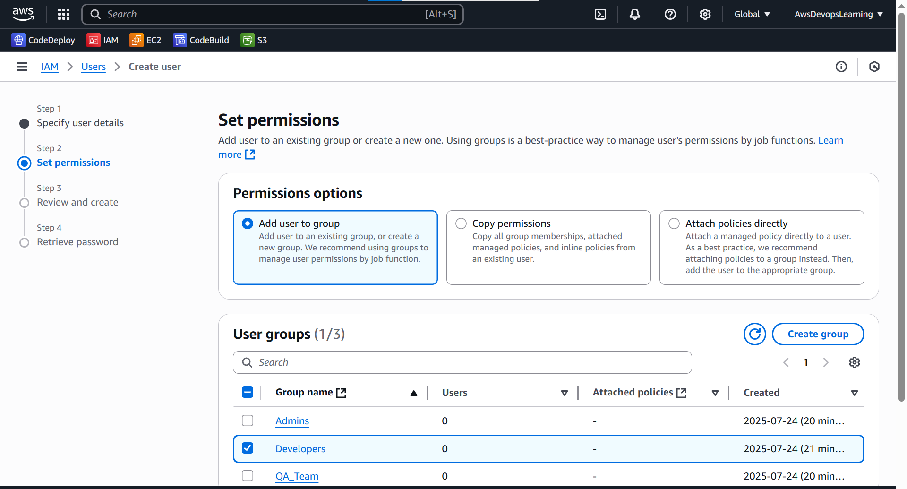

📸 *Create QA User*  
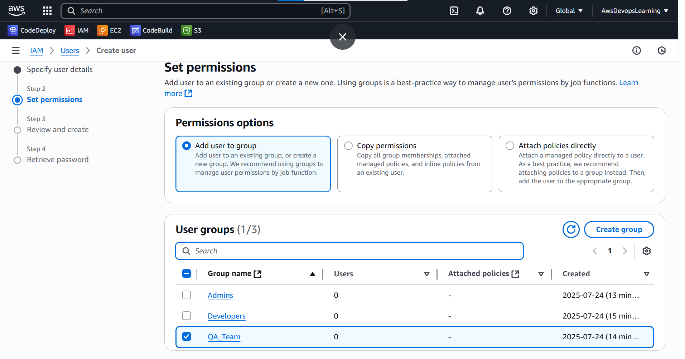

📸 *IAM Dashboard Overview*  
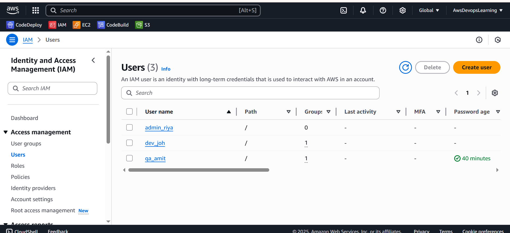

---

### ✅ Step 3: Created Custom S3 Read-Only Policy

A custom policy `S3ReadOnlyPolicy` was created to allow read-only access to an S3 bucket. It was attached to the `QA_Teams` group.

📸 *S3 Read-Only Policy JSON*  

Screenshot/Create-S3ReadOnlyPolicy-1.1.png

📸 *Attached to QA Group*  
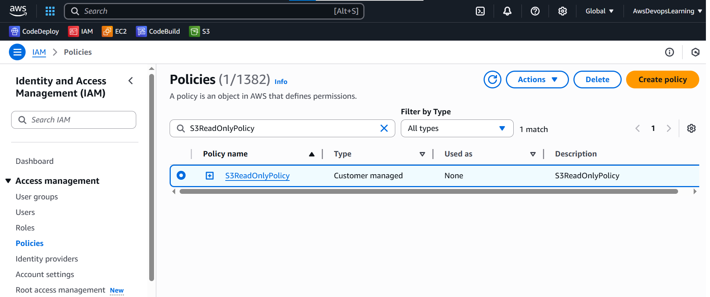  

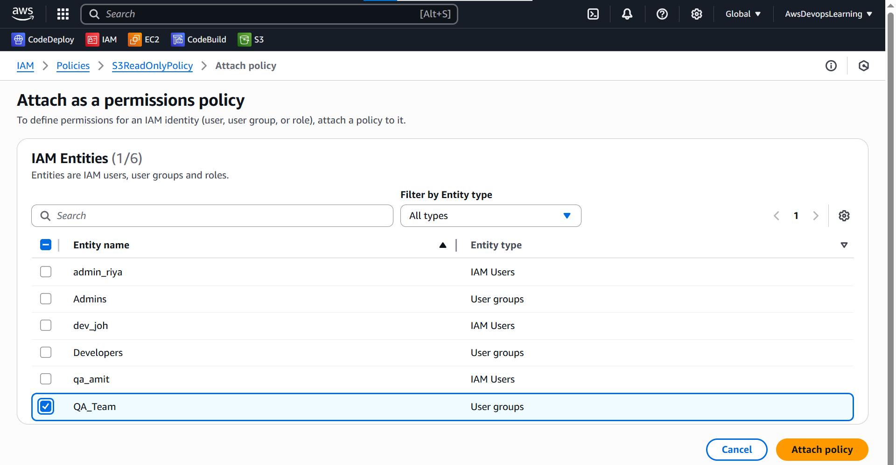

---

### ✅ Step 4: Created EC2 Start/Stop Policy

A custom policy `EC2StartStopPolicy` was created to allow only EC2 **Start** and **Stop** actions. It was attached to the `Developers` group.

📸 *EC2 Start/Stop Policy JSON*  
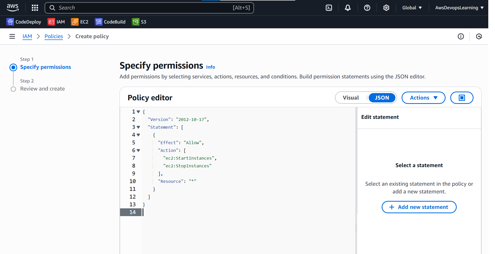

📸 *Attached to Developer Group*  
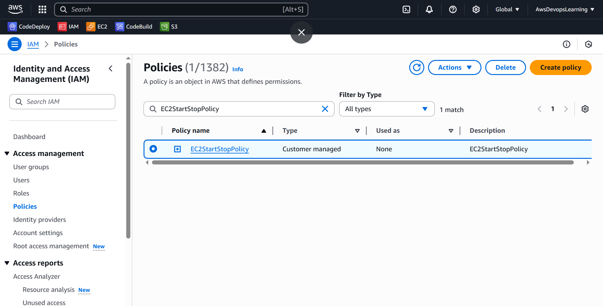  
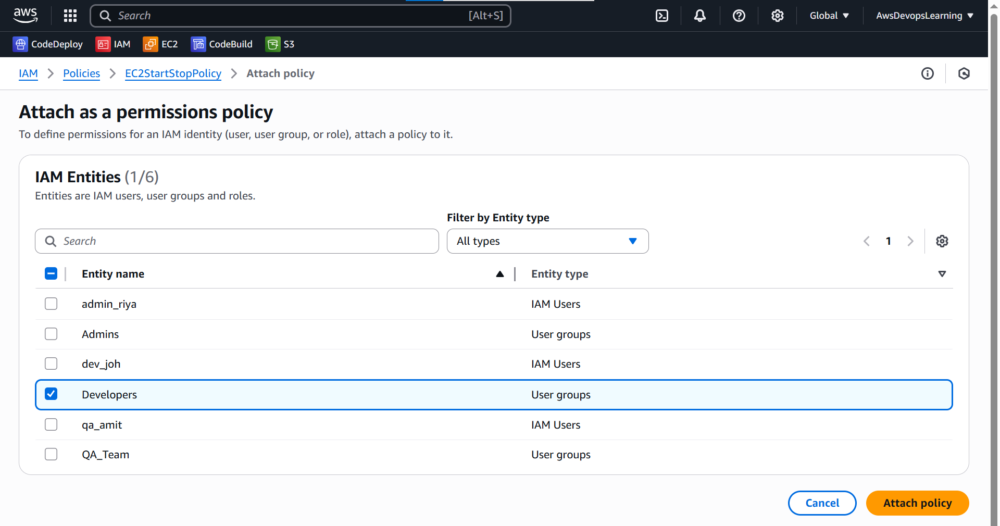

---

### ✅ Step 5: Granted Full Admin Access to Admins Group

AWS managed policies `AmazonEC2FullAccess` and `AmazonS3FullAccess` were attached to the `Admins` group.

📸 *Attach EC2 and S3 Policies to Admins*  
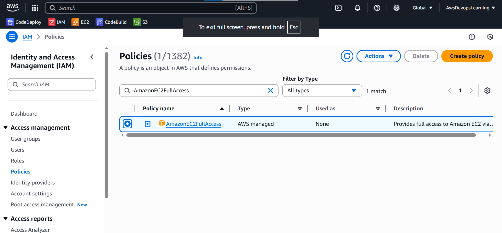  
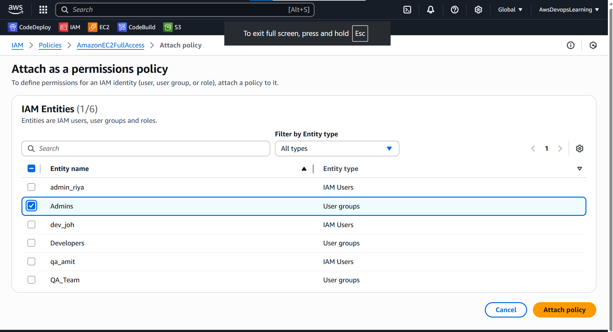

---

## 🎯 Project Objectives

- ✅ Use IAM groups to simplify permission management
- ✅ Apply **Least Privilege Principle**
- ✅ Use custom policies to restrict access (S3 ReadOnly, EC2 Start/Stop)
- ✅ Use AWS managed policies for full access where needed
- ✅ Simulate real support scenarios and IAM troubleshooting

---

## ✅ Outcomes

This project helped me understand how to:
- Create IAM groups and assign job-based access
- Use and debug custom IAM policies
- Simulate real-world L1/L2 support issues (user access denied, fixing permissions, etc.)

---

